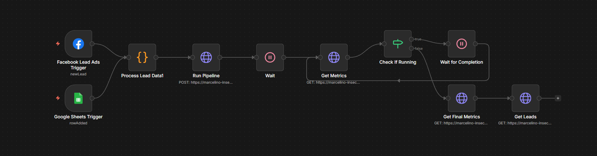

# n8n Workflow Configuration

This document explains how to configure the n8n workflow for the Lead Generation Pipeline.

## Workflow Diagram



The workflow automatically processes leads from Facebook Lead Ads and Google Sheets, enriches them with AI, generates personalized messages, and sends outreach emails.

## Remote n8n Instance

This project uses a self-hosted n8n instance accessible at:
- **URL**: https://92e249f97c50.ngrok-free.app
- **Workflow ID**: Dl9AKWe6K3mx3qUO2q-VJ
- **Workflow URL**: https://92e249f97c50.ngrok-free.app/workflow/Dl9AKWe6K3mx3qUO2q-VJ

## Docker Setup (Alternative - Not Required)

### Prerequisites

- Docker installed on your system ([Download Docker](https://www.docker.com/get-started))
- Docker daemon running

### Step-by-Step Docker Installation

#### 1. Pull the n8n Docker Image

Open your terminal and run:

```bash
docker pull n8nio/n8n:2.2.5
```

This will download the n8n version 2.2.5 image from Docker Hub.

#### 2. Run n8n Container

Start the n8n container with the following command:

```bash
docker run -it --rm \
  -p 5678:5678 \
  -e N8N_BASIC_AUTH_ACTIVE=false \
  n8nio/n8n:2.2.5
```

**Command Breakdown:**
- `docker run` - Run a new container
- `-it` - Interactive mode with terminal
- `--rm` - Automatically remove container when stopped
- `-p 5678:5678` - Map port 5678 (host:container)
- `-e N8N_BASIC_AUTH_ACTIVE=false` - Disable authentication (for local development)
- `n8nio/n8n:2.2.5` - Image name and version

**For Windows (PowerShell):**
```powershell
docker run -it --rm -p 5678:5678 -e N8N_BASIC_AUTH_ACTIVE=false n8nio/n8n:2.2.5
```

#### 3. Access n8n

Once the container is running, you'll see output like:
```
Editor is now accessible via:
http://localhost:5678
```

Open your browser and navigate to: **http://localhost:5678**

#### 4. Stop n8n

To stop n8n, press `Ctrl+C` in the terminal where it's running.

### Alternative: Run with Data Persistence

To persist workflows and data between restarts:

```bash
docker run -it --rm \
  -p 5678:5678 \
  -e N8N_BASIC_AUTH_ACTIVE=false \
  -v ~/.n8n:/home/node/.n8n \
  n8nio/n8n:2.2.5
```

This mounts a local directory to store n8n data.

## Overview

The n8n workflow orchestrates the entire lead generation pipeline by calling the MCP server tools in sequence.

## Workflow Structure

The workflow consists of the following nodes:

1. **Manual Trigger** - Start the pipeline manually
2. **Generate Leads** - Call MCP `generate_leads` tool
3. **Enrich Leads** - Call MCP `enrich_leads` tool
4. **Generate Messages** - Call MCP `generate_messages` tool
5. **Send Outreach** - Call MCP `send_outreach` tool
6. **Get Status** - Call MCP `get_status` tool

## MCP Server Connection

The workflow connects to the MCP server running at `http://localhost:8000` (or your configured port).

## Setup Instructions

### 1. Import Workflow

1. Open n8n at https://92e249f97c50.ngrok-free.app
2. Click "Import from File" or "Import from URL"
3. Import the `n8n-workflow.json` file from this directory

### 2. Configure MCP Connection

For each HTTP Request node:

**Base Configuration:**
- Method: POST
- URL: `http://localhost:8000/mcp/call_tool`
- Authentication: None (for local development)

**Headers:**
```json
{
  "Content-Type": "application/json"
}
```

### 3. Node Configuration

#### Generate Leads Node
```json
{
  "name": "generate_leads",
  "arguments": {
    "count": 200,
    "seed": 42
  }
}
```

#### Enrich Leads Node
```json
{
  "name": "enrich_leads",
  "arguments": {
    "mode": "offline"
  }
}
```

#### Generate Messages Node
```json
{
  "name": "generate_messages",
  "arguments": {}
}
```

#### Send Outreach Node
```json
{
  "name": "send_outreach",
  "arguments": {
    "channel": "both",
    "dry_run": true
  }
}
```

#### Get Status Node
```json
{
  "name": "get_status",
  "arguments": {}
}
```

## Alternative: Direct API Integration

Instead of calling MCP tools, you can also call the FastAPI endpoints directly:

### API Endpoints

1. **Generate & Enrich**: `POST /pipeline/run`
   ```json
   {
     "dry_run": true,
     "enrichment_mode": "offline",
     "lead_count": 200,
     "channel": "both"
   }
   ```

2. **Get Metrics**: `GET /metrics`

3. **Get Leads**: `GET /leads?limit=50`

## Error Handling

Add error handling nodes after each step:

1. **On Error** - Catch errors from MCP calls
2. **Notify** - Send notification about failures
3. **Retry** - Implement retry logic for transient failures

## Rate Limiting

The workflow should respect rate limits:

- Add delay nodes between operations
- Configure max 10 messages per minute for outreach
- Implement exponential backoff for retries

## Monitoring

Add monitoring nodes to track:

- Execution time for each stage
- Success/failure rates
- Lead status transitions
- API response times

## Example Workflow Execution

```
Manual Trigger
    ↓
Generate Leads (200 leads)
    ↓
Enrich Leads (offline mode)
    ↓
Generate Messages (A/B variations)
    ↓
Send Outreach (dry run)
    ↓
Get Final Status
    ↓
Store Results
```

## Variables

Configure these workflow variables:

- `LEAD_COUNT`: Number of leads to generate (default: 200)
- `ENRICHMENT_MODE`: "offline" or "ai" (default: "offline")
- `DRY_RUN`: true or false (default: true)
- `CHANNEL`: "email", "linkedin", or "both" (default: "both")

## Testing

1. Start with `DRY_RUN=true` to test without sending
2. Use a small `LEAD_COUNT` (e.g., 10) for initial tests
3. Check logs in n8n execution panel
4. Verify data in SQLite database
5. Check frontend dashboard for updates

## Production Deployment

For production:

1. Enable authentication on MCP server
2. Use environment variables for sensitive data
3. Set up proper error notifications
4. Configure retry logic with exponential backoff
5. Monitor execution logs
6. Set `DRY_RUN=false` for live sending
7. Configure proper SMTP credentials

## Troubleshooting

### Connection Issues

- Verify MCP server is running
- Check API endpoint URLs
- Confirm ports are not blocked by firewall

### Tool Call Failures

- Check MCP server logs
- Verify tool parameters are correct
- Ensure database is initialized

### Rate Limiting

- Increase delays between operations
- Reduce batch sizes
- Check RATE_LIMIT_PER_MINUTE setting

## Support

For issues:

1. Check n8n execution logs
2. Review MCP server output
3. Examine FastAPI logs
4. Verify database contents
